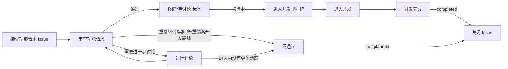
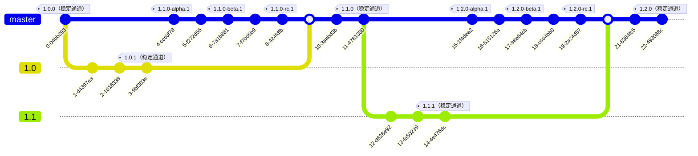

# 向 Tuack-NG 贡献代码

❤️感谢您向 Tuack-NG 做出贡献，您可以为 Tuack-NG 项目做出包括但不限于反馈 Bug、提出功能请求、贡献代码等贡献。在进行贡献前，请务必阅读以下指南。

## 反馈 Bug

如果在使用 Tuack-NG 的过程中遇到 Bug，可以在 [Issues](https://github.com/tuack-ng/tuack-ng/issues/new?assignees=&labels=Bug&projects=&template=BugReport.yml&title=%EF%BC%88%E5%9C%A8%E8%BF%99%E9%87%8C%E8%BE%93%E5%85%A5%E4%BD%A0%E7%9A%84%E6%A0%87%E9%A2%98%EF%BC%89) 中提交 Bug 反馈。

**请务必准确地按照 Issues 模板中的要求和示例填写相关字段**，否则开发者可能难以诊断您遇到的问题。

## 提交功能请求

如果您有关于 Tuack-NG 新功能的想法，欢迎在 [Issues](https://github.com/tuack-ng/tuack-ng/issues/new?assignees=&labels=%E6%96%B0%E5%8A%9F%E8%83%BD&projects=&template=FeatureRequest.yml&title=%EF%BC%88%E5%9C%A8%E8%BF%99%E9%87%8C%E8%BE%93%E5%85%A5%E4%BD%A0%E7%9A%84%E6%A0%87%E9%A2%98%EF%BC%89) 提交功能请求。提交的功能请求必须满足以下要求：

- 提交的功能在应用  版本，和 [最新提交](https://github.com/tuack-ng/tuack-ng/commits/master/) 中还没有实现。
- 没有与此功能请求重复或相似的 [Issues](https://github.com/tuack-ng/tuack-ng/issues?q=type%特性) 。
- 提交的的功能是用户广泛需要的，且没有超出 Tuack-NG 作为**出题工具**的开发目标，而非添加与出题相关辅助功能无关的内容。

提交的功能请求会按照以下流程处理：

您可以在[投票页面](https://github.com/Tuack-NG/voting/discussions/categories/Tuack-NG)为您想要的功能进行投票，开发者会结合多种因素，优先处理票数较高的功能请求。需要注意，受限于时间和精力，**票数高的功能请求不是 100% 会被开发者优先处理**，还请谅解。如果您有能力，欢迎为本项目贡献代码。

## 贡献代码

在为 Tuack-NG 贡献代码之前，请务必阅读以下指南。

<!--
TODO

下面是一些有用的资源：

- [Tuack-NG 开发文档](https://docs.tuack-ng.tech/dev)
- [项目看板](https://github.com/orgs/tuack-ng/projects/2)
-->

### 贡献准则

**您为 Tuack-NG 贡献的功能须遵循以下准则：**

- **稳定：** 您贡献的功能需要能尽可能稳定工作。
- **具有泛用性：** 您贡献的功能需要面向大部分用户。
- **如果您贡献的功能比较激进，请添加功能开关，并默认禁用此功能。** 激进的功能一般指会对正常授课产生较大影响的功能。
- **能用：** 在提交补丁前，请在本地测试您实现的功能是否能正常使用。
- 尽量不要提交仅包含文案修复的补丁。

### 补丁质量

随着 LLM 工具的进一步发展，开源项目经常被无效的（可能是 LLM 生成的）补丁充斥。这些补丁有的完全不能实现预期的功能，有的甚至根本不能通过编译，浪费了开发者的时间和精力对这些补丁进行代码审阅和问题排查。我们接受有瑕疵的补丁， **但我们希望您在提交补丁前，您的补丁至少应该满足以下的要求：**

- 实现的功能能够工作，在提交补丁前请至少在本地机器测试一次补丁的功能是否可以正常工作。
- 我们不建议在没有人为干预的情况下完全地使用生成式人工智能实现您要贡献的功能。

如果您持续提交低质量的补丁，我们可能会限制您继续向本项目/组织提交补丁。

### 分支与开发周期

Tuack-NG 代码仓库目前具有以下分支：

- [`master`](https://github.com/tuack-ng/tuack-ng/tree/master)：Tuack-NG 主要开发分支。
- `x.x`（版本号，如 `1.0`）：Tuack-NG 对分支版本对应的版本的维护分支。

当开始下个版本的 Tuack-NG 时，会将当前的主分支分叉到对应的维护分支。在开发下一个版本的 Tuack-NG 过程中，也会在维护分支上并行维护当前稳定版本的功能，如以下示意图所示：

> [!note]
> 以下图表的提交 id 和标签名称仅供示意。

由于不同开发分支上的代码接口可能存在差异。因此，**根据您做出的贡献类型，您需要选择不同的基础分支。**

**以下类型的贡献建议以当前的维护分支为基础分支：**

- 修复稳定版中的 Bug
- 对稳定版中的功能进行小幅度的优化

**以下类型的贡献建议以 `master` 为基础分支：**

- 添加新的功能
- 对代码进行重构
- 其它对 Tuack-NG 进行较大改动的贡献
- 修改 README 等文档

### 提交

在本代码仓库提交时，请尽量遵守[约定式提交规范](https://www.conventionalcommits.org/zh-hans/v1.0.0/)。

### 合并更改

在进行合并之前，请先测试您贡献的代码，确保您贡献的代码能稳定运作。

您可以向本项目发起 [Pull Request](https://github.com/tuack-ng/tuack-ng/pulls) 来合并您的更改。在发起 Pull Request 时，请简要地描述您做的更改，并最好附上您实现的功能的演示截图/视频。

<!-- ## 还有疑问？

您可以 [加入 QQ 群](https://qm.qq.com/q/4NsDQKiAuQ) 与开发者和其他用户讨论。 -->
